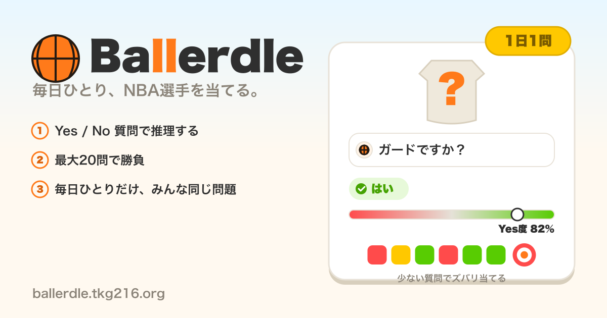

# Ballerdle



毎日ひとり、NBA選手を当てる日次チャレンジ。Yes/No 質問を最大20問重ねて、AI が「隠し持つ」その日の選手を当てる Web ゲーム。

**▶ 遊ぶ: https://ballerdle.tkg216.org**

## 構成

- **Cloudflare Workers** 単体でフロント配信と API を兼ねる。
- 推論は `BACKEND=jev` かつ `TYPESAFE_API_KEY`（Worker Secret）設定時、**typesafe.ai の REST API を直接呼び出す**（`POST https://api.typesafe.ai/v1/systemone`, `model: "jev-latest"`）。ユーザーの質問は Jev の **Noul**（真偽の確率）で評価し、はい / いいえ / たぶん にマッピング。
  - `BACKEND` 未設定 or `TYPESAFE_API_KEY` 未設定時は **Cloudflare Workers AI の無料モデル `@cf/meta/llama-3.3-70b-instruct-fp8-fast`**（`env.AI.run`）にフォールバック（較正済み確率が無いためゲージは非表示）。
- **その日の隠し選手**は JST基準の通し日数から決定論的に選出（`src/daily.ts`）。全員が同じ日に同じ選手を引く（Wordle方式）。選手名はサーバ内でのみ算出し、正解/降参時以外はレスポンスに含めない。トークンやKVは不要なステートレス構成。
- 同じ質問/推測の重複呼び出しは Cache API（`caches.default`）で1日キャッシュし、Jev 呼び出しを節約する。
- 進捗（質問ログ・残数・勝敗）とストリークはクライアントの `localStorage` に保存し、1日1回のプレイを担保する。

- 判定に使う**選手ファクト**（身長・在籍年・受賞数など）は `data/players.json`（83名）に持ち、Jev の `state` に同梱する。モデルは cm 単位の数値を鋭く保持しておらず（閾値の確率が非単調になる）、事実を渡すと判定が安定するため。ポジションや出身国のようにモデルが元から高精度な項目は持たない。実行時に外部APIへはアクセスせず、バンドル同梱のJSONを読むだけ。

## 開発

```bash
npm install
npx wrangler login      # 初回のみ
npm run dev             # ローカル起動（Workers AI は実体が Cloudflare 側のため要ログイン）
npm run typecheck       # tsc --noEmit
```

## スクリプト

いずれも**生成物をコミットする**運用。実行環境に制約があるので注意。

| スクリプト | 用途 | 実行環境の制約 |
|---|---|---|
| `scripts/fetch-facts.py` | NBA公式（nba_api）から選手ファクトを取得し `data/players.json` を生成 | **住宅回線のローカルのみ**。`stats.nba.com` は Akamai の bot 判定によりクラウドIP・CIからは到達できない |
| `scripts/make-og.mjs` | OGP画像 `public/og.png`(1200x630) を生成 | **macOS のみ**。日本語描画に `Hiragino Sans` を使うため Linux では豆腐化する。CIでは構文チェックのみ行い実行しない |

```bash
# 選手ファクトの再取得
uv run --python 3.12 --with nba_api python scripts/fetch-facts.py

# OGP画像の再生成（macOS）
node scripts/make-og.mjs
```

## デプロイ

`main` へのマージで GitHub Actions が**自動デプロイ**する（`.github/workflows/deploy.yml`）。
`main` は保護されており直接 push できないため、変更はすべて PR 経由。

手動実行したい場合は Actions から `Deploy` → `Run workflow`、またはローカルで `npm run deploy`。
